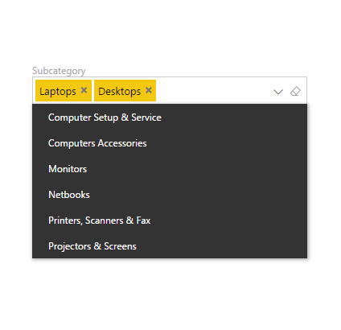

# Smart Filter for Power BI

Smart Filter by OKViz works like an observer, showing the current filters set in the report page, or like a slicer, allowing you to choose records from a drop-down list or search by typing a few letters.

Find out more on http://okviz.com/smart-filter/

### Copyrights

Copyright (c) 2016-2017 OKViz - trademark of SQLBI Corp.

See the [LICENSE](/LICENSE) file for license rights and limitations (MIT).